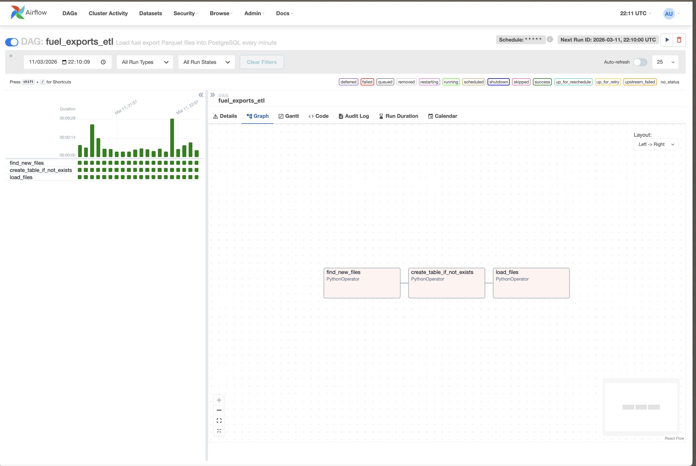

# Fuel Exports ETL — Airflow DAG



## How it works

A data generator script (`generate_fuel_exports.py`) produces one Parquet file per minute into a `./data/` directory. Each file contains 300 rows representing synthetic interspace fuel station transactions.

The Airflow DAG (`fuel_exports_etl`) runs on the same schedule — every minute — and processes any new files it finds.

The DAG has 3 tasks that run in sequence:

**1. `find_new_files`** — scans the `./data/` folder and compares the contents against a `.processed_files.json` tracker to identify files that haven't been loaded yet. The list of new files is passed to the next task via Airflow XCom.

**2. `create_table_if_not_exists`** — connects to PostgreSQL and creates the `fuel_exports` table if it doesn't already exist. Safe to run every time.

**3. `load_files`** — reads each new Parquet file into a pandas DataFrame, flattens two nested fields (`dock` struct → `dock_bay` + `dock_level`, `services` list → PostgreSQL `TEXT[]`), and inserts all rows into PostgreSQL. Uses `ON CONFLICT DO NOTHING` to avoid duplicates. Once a file is loaded successfully, its name is saved to the tracker so it won't be processed again.

## How to run

```bash
# Start all services
docker compose up -d

# Launch the data generator (runs until Ctrl+C)
python generate_fuel_exports.py
```

Airflow UI is available at [http://localhost:8080](http://localhost:8080) (login: `admin` / `admin`).
